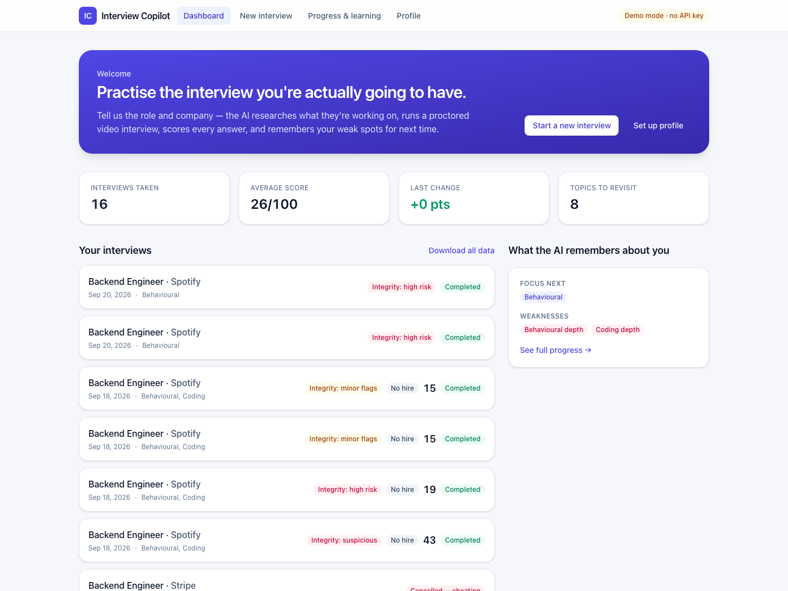
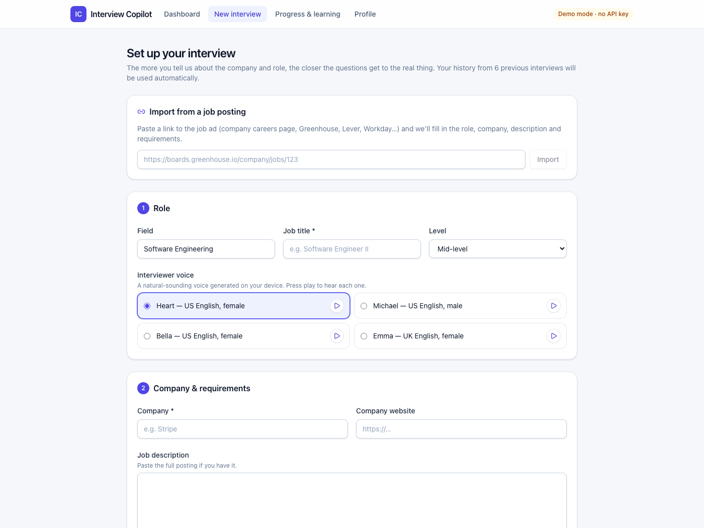
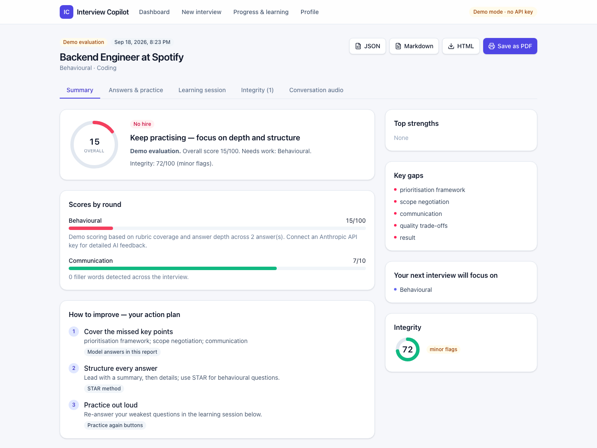
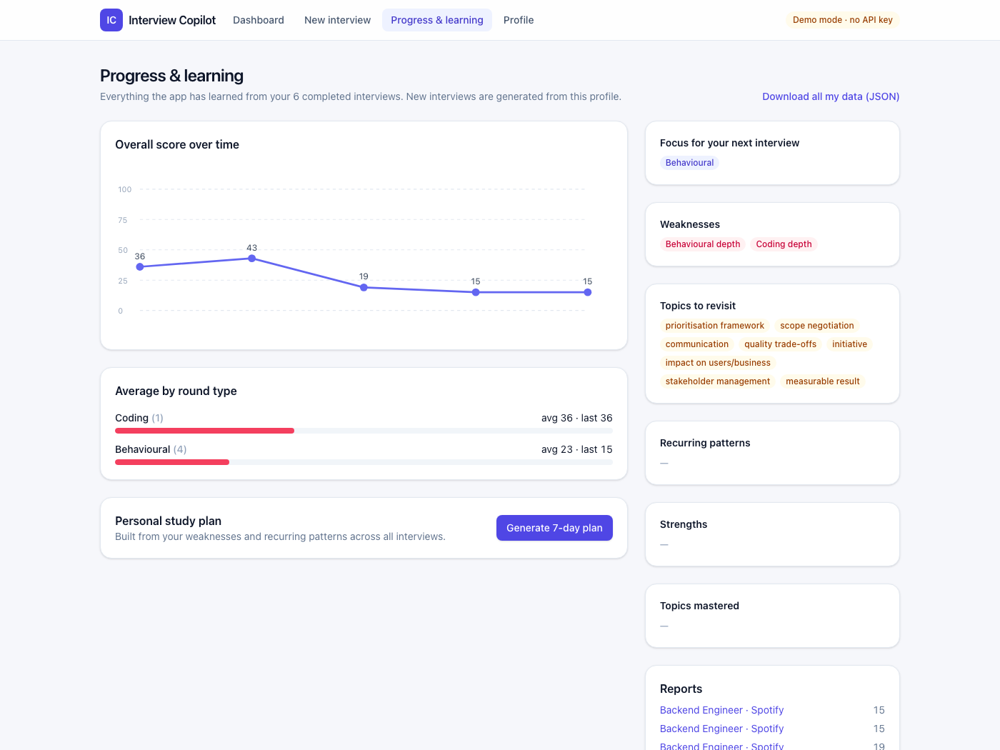

# Interview Copilot

> An AI mock-interview workspace for deliberate practice, feedback, and measurable improvement across interviews.

**[Open the deployed app →](https://interview-copilot-sepia.vercel.app)** _(deployment access is currently protected)_



## Inspiration

Most interview practice is hard to personalize and even harder to carry forward. Interview Copilot was built to turn a target role, job posting, resume, and prior interview history into a focused practice loop that helps candidates identify weak areas and return better prepared.

## What it does

- **Prepares for a specific job.** Import a resume and a job posting (URL or pasted text), and the AI researches what the company is working on right now, then writes technical, coding, behavioral, system-design and HR rounds around it.
- **Runs the interview out loud.** The interviewer speaks with a natural, human-sounding voice generated on your own device; you answer by voice or by typing, and coding questions open an editor that runs JavaScript in the browser. It asks follow-up questions when an answer is thin, and you can ask for clarifications the way you would with a real interviewer.
- **Proctors the session.** The camera stays on, with face tracking, tab and focus changes, paste monitoring, and voice monitoring that checks whether anyone else is nearby — all reported as auditable signals, never as proof.
- **Scores and coaches.** Every answer gets a score, a model answer and specific gaps; a learning session lets you ask the coach about your own transcript, and you can re-answer weak questions on the spot.
- **Remembers.** Strengths, weak topics and recurring patterns carry into the next interview, so it gets harder where you are weak. Everything is exportable as JSON, Markdown, HTML or PDF.

| Setting up an interview | The report afterwards |
|---|---|
|  |  |



## How we built it

The product is built with **Next.js**, **TypeScript**, React and an Anthropic-powered AI engine with Zod-validated structured outputs. It uses local SQLite in development and hosted Postgres/Vercel Blob in deployment, alongside browser media APIs, MediaPipe, ONNX Runtime and a modular test suite.

Four pieces are worth calling out:

- **The interviewer's voice runs in the browser.** Kokoro-82M is synthesized in a Web Worker on ONNX Runtime, so the conversation can be mixed into the recording — browser speech synthesis cannot be captured by a web page. Lines the interviewer is about to say are prepared while the candidate answers, and the model downloads while the questions are still being written.
- **Voice monitoring never leaves the device.** Silero VAD finds speech, a WeSpeaker embedding compares it with the candidate's enrolled voice, and loudness stands in for distance. Two mismatched windows raise a warning; another within two minutes ends the interview.
- **Integrity is deterministic.** Scores come from weighted proctoring events rather than from a model, so every flag in the report traces back to an event with its timestamp and snapshot.
- **Storage is swappable.** One small SQL interface backs both `node:sqlite` locally and Neon Postgres in deployment, and the same shared test suites run against both.

## Challenges we ran into

- Making an interview feel conversational required low-latency follow-ups without weakening evaluation quality or schema validation.
- The voice had to sound human, not like a screen reader. That meant trimming the silence the model adds to every sentence, pausing between sentences the way people do, preparing upcoming lines ahead of time, and moving synthesis off the main thread once it turned out to be stalling audio playback and face tracking.
- Proctoring signals such as camera state, tab focus, pasted content and nearby voices needed to be treated as auditable indicators — not proof of misconduct.
- Handling resumes, recordings, snapshots and interview history required a privacy-conscious local/hosted storage design.

## Accomplishments we're proud of

- Built a complete practice loop: preparation, live interview, evaluation, coaching, repeat practice, cross-interview insights, and export.
- Added an integrity layer with face/camera checks, focus and paste events, voice enrollment, nearby-speaker detection, and audio-only conversation recording.
- Kept the heavy parts — speech synthesis, speaker recognition, face tracking — entirely in the browser, so no audio or video of a practice session is sent to a third party.

## What we learned

AI coaching works best when it remembers prior practice while keeping feedback specific, explainable, and respectful of uncertainty. The project also reinforced that integrity tooling must present evidence and limitations clearly.

## What's next

Potential next steps include stronger multi-user access control, richer interview analytics, and a reviewer workflow for human-led mock interviews.

## Built with

`Next.js` · `TypeScript` · `React` · `Anthropic` · `Zod` · `SQLite` · `PostgreSQL` · `Vercel Blob` · `Clerk` · `ONNX Runtime` · `Kokoro TTS` · `Silero VAD` · `WeSpeaker` · `MediaPipe` · `Monaco` · `Vitest`

## Run locally

Requires **Node.js 22.13+** (for the built-in `node:sqlite`) and **Chrome or Edge** (for voice answers and recording).

```bash
npm install
npm run dev
```

That is enough to try the whole flow: with no API key the app runs in **demo mode**, using a built-in question bank and heuristic scoring. For AI-generated interviews, add a key:

```bash
cp .env.example .env.local   # then set ANTHROPIC_API_KEY=... in it
```

Useful commands:

```bash
npm test          # shared suites run against both SQLite and Postgres
npm run typecheck
npm run build
```

The first interview downloads the voice model (~90 MB) once and keeps it in the browser cache. Interviews, recordings and snapshots are stored under `data/` locally, or in Postgres + Vercel Blob when `DATABASE_URL` and `BLOB_READ_WRITE_TOKEN` are set.

## Login (optional)

By default the app is open to whoever can reach it, with a single shared profile — fine for local use. [Clerk](https://clerk.com) adds accounts: everyone who signs in gets their own private profile, resume and interview history, isolated from everyone else's.

1. Create a free application at [clerk.com](https://clerk.com) and copy its **Publishable key** and **Secret key** into `.env.local` (and into your Vercel project's environment variables for the deployed site).
2. In the Clerk Dashboard, open **Restrictions** and leave sign-up **Open** so anyone can create an account — each account only ever sees its own data, so there's nothing to restrict.
3. Restart the app (or redeploy). A sign-in page now appears before anything else, and a `⋮` account menu shows up in the header with a sign-out option.

Leaving the two keys unset skips all of this — the app runs exactly as it does without them, with one shared profile. If you were already using the app before adding login, set `ALLOWED_EMAILS` to the email you'll sign in with — see `.env.example` for how the one-time handoff works.

## Privacy

Microphone audio, the voice profile and camera frames are processed on your own device: speaker recognition, speech detection and face tracking all run in the browser. The conversation recording contains audio only — never video of you. Interview content goes to the Anthropic API only in AI mode, and the voice model is fetched from Hugging Face with no interview content attached. Deleting an interview removes its answers, recording and snapshots.

## Third-party models

| Model | Used for | License |
|---|---|---|
| [Kokoro-82M](https://huggingface.co/hexgrad/Kokoro-82M), ONNX export by [onnx-community](https://huggingface.co/onnx-community/Kokoro-82M-v1.0-ONNX) | The interviewer's voice | Apache 2.0 |
| [phonemizer](https://github.com/xenova/phonemizer), which bundles eSpeak NG | Turning text into phonemes for the voice | Apache 2.0 — **the bundled eSpeak NG engine is GPL-3.0** |
| [MediaPipe Face Landmarker](https://ai.google.dev/edge/mediapipe/solutions/vision/face_landmarker) | Face tracking | Apache 2.0 |
| [Silero VAD](https://github.com/snakers4/silero-vad) | Detecting speech | MIT |
| [WeSpeaker ResNet34](https://huggingface.co/pyannote/wespeaker-voxceleb-resnet34-LM), ONNX export by [onnx-community](https://huggingface.co/onnx-community/wespeaker-voxceleb-resnet34-LM) | Telling your voice apart from others | CC BY 4.0 |

This project is MIT licensed. Note the GPL-3.0 eSpeak NG engine inside the phonemizer package before redistributing a commercial build.
